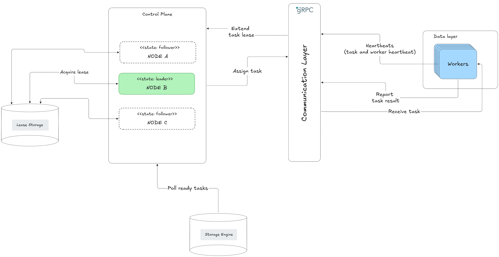
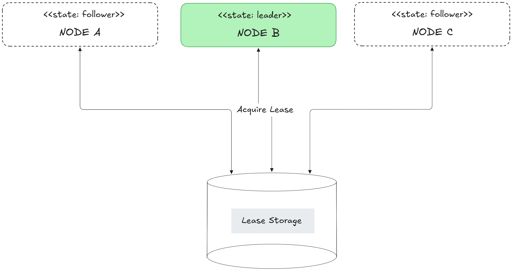

## Brief Summary of Augusta's Architecture



The system follows a relatively decoupled architecture. Breaking down its core modules into three layers; control plane, communication layer, and data layer.

### Layers

#### Control plane

The control plane can be described as a cluster of scheduler nodes responsible for accepting and orchestrating tasks. It uses these sub-modules to facilitate this, `Dispatcher`, `Elector`, `StorageEngine`, `LeaseStore`, and a REST API. The control plane ingests tasks through its API and store them in the StorageEngine, the Dispatcher periodically polls the StorageEngine for ready tasks, then passes it along to a selected worker(using a scheduling algorithm).



The control plane allows all scheduler nodes to accept incoming tasks on their api. But allows only one node(the leader) to schedule tasks and poll the StorageEngine. A leader is determined using [lease based leader election.](https://builder.aws.com/content/3Ev0vH0hfkcUizISUWYTvHibtcp/leader-election-in-distributed-systems)

#### Communication Layer

The communication layer sits between the control plane and the data layer. It handles communication through gRPC, using a multiplexed bidirectional stream. When a worker connects to a leader, the leader store information about the session in-memory. When a leader needs to reach out to a worker it searches in-memory for its session. And using the gRPC API send a message payload of:

```proto
message ServerMessage {
    oneof payload{
        RegisterAck ack = 1;
        TaskBatch tasks = 2;
    }
}
```

Workers communicates with a leader by sending a message payload of:

```proto
message ClientMessage {
    oneof payload{
        RegisterWorker register = 1;
        TaskHeartbeat task_heartbeat = 2;
        TaskResult task_result = 3;
        TaskResultBatch task_result_batch = 4;
    }
};
```

#### Data Layer

This is a worker or series of workers responsible for processing a tasks. It receives a task from the control plane, attepmts to process it and sends a report of the attempt. A worker sends periodic heartbeats to the control plane to maintain its session. It also sends heartbeats containing the ids of the tasks it is currently processing. This helps to prevent task from being marked as failed and re-scheduled in long running tasks situations.
